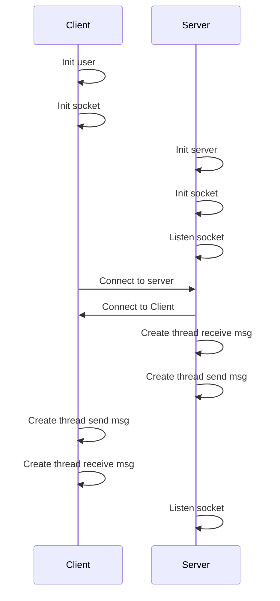
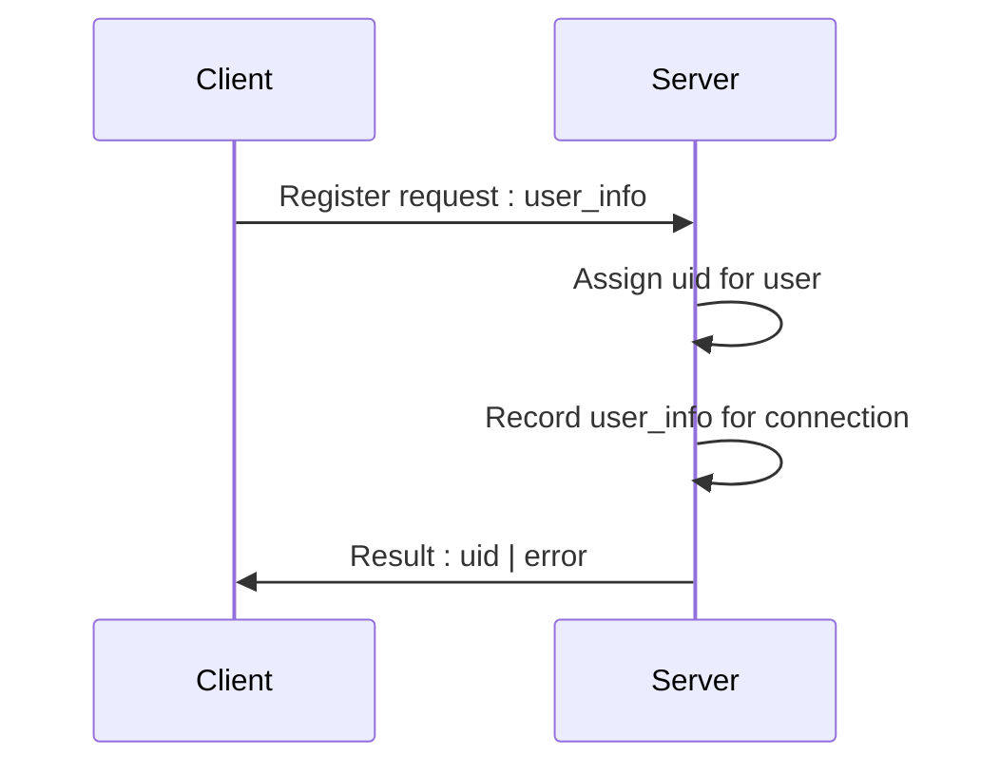

# 流程介绍

## 0. 建立初始连接

```mermaid
sequenceDiagram
	Client ->> Client : Init user
	Client ->> Client : Init socket

	Server ->> Server : Init server
	Server ->> Server : Init socket
	
	Server ->> Server : Listen socket

	Client ->> Server : Connect to server
	Server ->> Client : Connect to Client

	Server ->> Server : Create thread receive msg
	Server ->> Server : Create thread send msg

	Client ->> Client : Create thread send msg
	Client ->> Client : Create thread receive msg

	Server ->> Server : Listen socket
```

## 1. 登录服务器

时序图

```mermaid
sequenceDiagram
	Client ->> Server : Register request : user_info
	Server ->> Server : Assign uid for user
	Server ->> Server : Record user_info for connection
	Server ->> Client : Result : uid | error
```

客户端向服务器发起注册请求，并附带用户信息，如用户名等参数。

服务器会生成唯一的uid用于标识该用户，并将Socket和用户信息与uid进行绑定。若其他用户要与该用户通信的话，也是用uid作为目标。

## 2. 消息对话

```mermaid
sequenceDiagram
	
```
