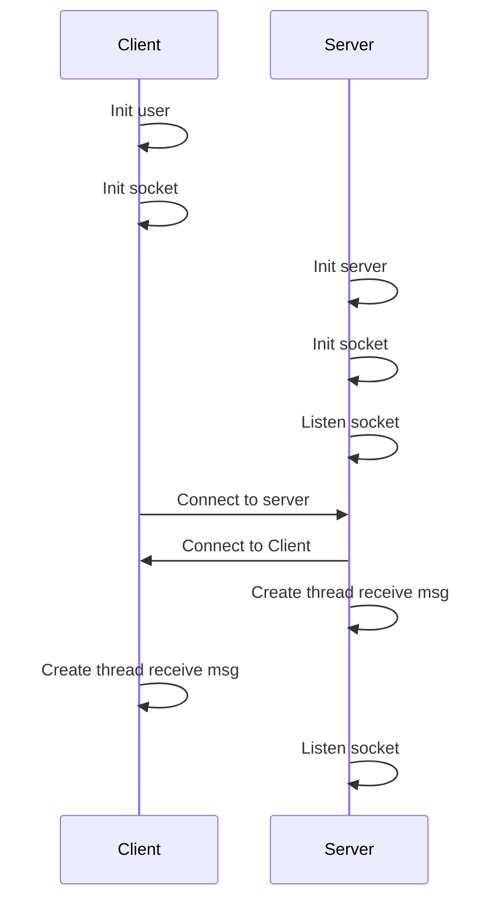
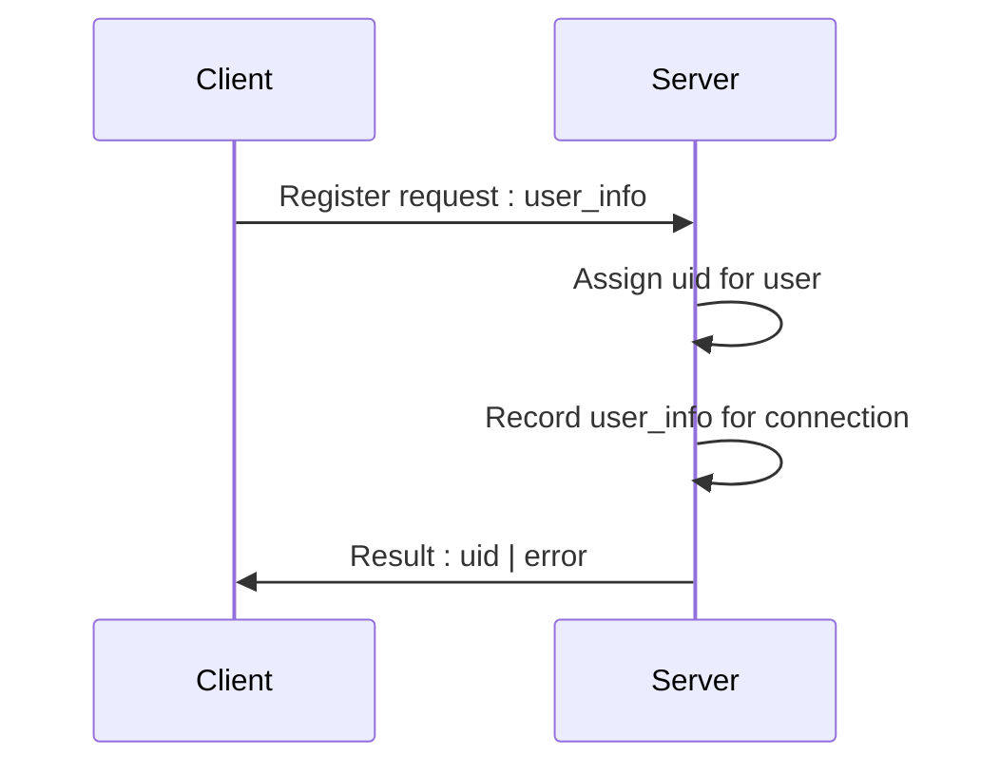

# 思路

## 0. 建立初始连接

ps：在客户端和服务器建立连接后服务器之后，二者都只创建了接收消息的线程，而没有创建发送消息的线程。

## 1. 登录服务器

时序图

客户端向服务器发起注册请求，并附带用户信息，如用户名等参数。

服务器会生成唯一的`uid`用于标识该用户，并将Socket和用户信息与uid进行绑定，生成一项`用户信息记录`记录在服务器的`用户信息表`。若其他用户要指定与该用户通信的话，也是使用uid作为目标。

## 2. 用户信息记录

## 3. 消息会话 Session

所有的用户对话都是以`Session`为单位，Session就像是一个个聊天室，私聊就是两个人的聊天室，群聊就是多人。

每个`Session`通过sid进行标识，还包括一个`用户信息表`用于记录会话的用户。

## 4. 发起私聊

## 5. 建立&加入群聊
